  <picture>
    <source media="(prefers-color-scheme: dark)" srcset="assets/skyline-dark.svg">
    <source media="(prefers-color-scheme: light)" srcset="assets/skyline-light.svg">
    
  </picture>

 

  <picture>
    <source media="(prefers-color-scheme: dark)" srcset="assets/intro-dark.svg">
    <source media="(prefers-color-scheme: light)" srcset="assets/intro-light.svg">
    
  </picture>

 

  <picture>
    <source media="(prefers-color-scheme: dark)" srcset="assets/directory-dark.svg">
    <source media="(prefers-color-scheme: light)" srcset="assets/directory-light.svg">
    
  </picture>

 

  <picture>
    <source media="(prefers-color-scheme: dark)" srcset="assets/stats-dark.svg">
    <source media="(prefers-color-scheme: light)" srcset="assets/stats-light.svg">
    
  </picture>

